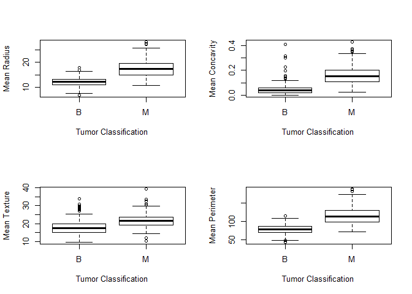
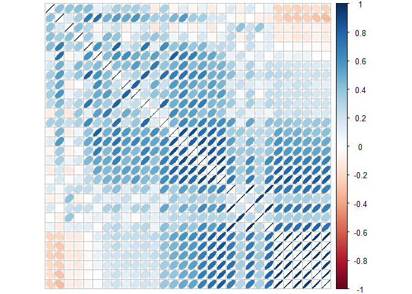

Project Proposal
================
Anne (Annie) Lott
January 24, 2019

An accurate diagnosis of breast cancer is critical to the well-being of the patient. If a patient with breast cancer is inaccurately classified as cancer-free, the patient will not receive the treatment she needs. On the other hand, if a patient without cancer is incorrectly diagnosed with cancer, the patient may undergo chemotherapy, which is harmful to a person's health, for no reason. In this project, I plan to analyze a data set of fine needle aspirate measurements made from pictures of breast tissue cell nuclei for patients with breast tumors. Each woman's tumor is categorized as benign (B) or malignant (M). I hope to develop an algorithm to accurately classify a woman's breast tumor as benign or malignant, thus making a correct diagnosis of breast cancer, based on the fine needle aspirate measurements of cell nuclei images.

This data set contains 569 observations of 32 variables, two of which are the ID number of the woman and the classification of the tumor. The remaining 30 variables consist of the means, standard errors, and maximum values of various numeric measurements of the breast tissue cell nuclei images. The features of the cell nuclei measured included the perimeter, area, radius, texture, smoothness, compactness (squared perimeter divided by area), concavity, concave points, fractal dimension, and symmetry, these last four variables all being different measures of shape of the cell nucleus. Repeated calculations of each of these descriptors were made, so that the the mean, standard error, and maximum of the descriptors were reported as variables in this data set. 357 observations are classified as benign and 212 are classified as malignant.

The set of four box plots above show some of the greatest differences in predictor variable values between the malignant (M) and benign (B) tumors. Based on these boxplots, we see that the mean radius, concavity, texture, and perimeter tend to be greater for nuclei of patients with cancer as opposed to those without cancer.

I next examine whether any of the predictors are correlated with each other through a correlagram. As we can see in the correlagram below (although it is unlabeled for simplicity) some of the variables are highly positively correlated with one another, indicated by the skinny blue upward-facing ellipses. This makes the data mining task challenging as I will need to offset the effects of the variable correlations in my model.

Although the data set only includes quantitative independent variables, I believe it will be fairly difficult to analyze and model because, since it is real biological data, there should be a good degree of noise or randomness in the measurements. Considering that most models easily accomodate both quantitative and qualitative predictors, the lack of qualitative predictors won't significantly decrease the difficulty of the problem. Sifting through the noise in the data set and identifying the important predictors out of 30 will make this data mining task challenging.

The data mining task for this data set is classifying the tumors as benign or malignant. Possible models I can consider are logistic regression, random forests or other tree methods, support vector machines, or other models. Ultimately, discovering a model to predict breast cancer diagnosis with high accuracy could aid healthcare professionals in making the right call for patients with, or without, this harrowing disease.

References:

Data.world: Breast Cancer Wisconsin. <https://data.world/health/breast-cancer-wisconsin>.

W.N. Street, W.H. Wolberg and O.L. Mangasarian (1993). "Nuclear feature extraction for breast tumor diagnosis." *IS&T/SPIE 1993 International Symposium on Electronic Imaging: Science and Technology, (1905),* 861-870.
