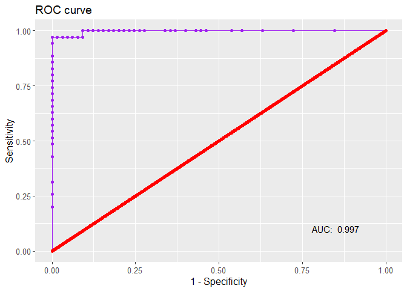

Breast Cancer Diagnosis Project
================
Anne (Annie) Lott


Introduction
============

An accurate diagnosis of breast cancer is critical to the well-being of the patient. The analysis of data from fine needle aspirate (FNA) images of cell nuclei sampled from benign and malignant breast tumors can be applied to develop a statistical learning model to correctly classify tumors as cancerous or benign, using measurements taken from similar FNA images. The data set used in this study is a cleaned version of the Street et al. (1993) data from the University of Wisconsin, which consists of 569 observations of women with breast tumors. The dependent variable is whether the tumor was malignant or benign, and the 30 features of the data are measures of the shape, size, and texture of the tumor cell nuclei derived from the FNA images.

The 569 observations were randomly divided among training, validation, and test sets, and a suite of classification techniques were applied to the data to categorize the tumor image observations as malignant or benign. The methods investigated were the logistic regression model, random forests, support vector machines with linear kernels, and k nearest neighbors.

``` r
#set working directory externally
#read in data
cancer = read.csv("data.csv", header = TRUE, row.names = "id")

#load libraries
library(caret)
library(dplyr)
library(leaps)
library(caret)
library(e1071)
library(tibble)
library(ggplot2)
library(Deducer)
library(class)
library(rknn)
library(ROCR)
library(randomForest)

#set seed for data splitting
set.seed(1234)

#no missing values in this diagnostic data set
length(which(is.na(cancer)))
```

    ## [1] 0

``` r
#find out how many observations and variables there are
ncol(cancer)
```

    ## [1] 31

``` r
nrow(cancer)
```

    ## [1] 569

``` r
#determine how many malignant and benign cases there are
nrow(cancer[cancer["diagnosis"] == "B",])
```

    ## [1] 357

``` r
nrow(cancer[cancer["diagnosis"] == "M",])
```

    ## [1] 212

Data Set Description
====================

To build this data set, scientists took FNA images of cell nuclei from breast tumors that had already been classified as malignant or benign. An example of a breast tumor cell nuclei FNA image is shown as follows:


Based on these images, various measurements of shape, size, and texture of the cell nuclei were taken, with each variable in the data set given as an average, standard error, or mean of the three largest values of several measurements of the same type. For example, the mean radius of all the cell nuclei in a tumor sample image is provided for each observation, as well as the standard error of the cell nuclei radii for the observation and the average of the three largest cell nuclei radii, labeled as “worst”.

Other derived measurements of imaged cell nuclei include the texture, calculated as the standard deviation of gray-scale values; smoothness, or the local variation in the lengths of radii; compactness, or perimeter squared divided by area minus 1; and fractal dimension, the “coastline approximation” minus one. The “coastline approximation” is developed through approximating the perimeter of the cell nucleus with increasingly large line segments. The slope of these values on the log scale versus the size of the line segments is used to compute this “coastline approximation”.

As shown above, in this data set there are 357 observations that are classified as benign and 212 observations that are classified as malignant.

Methodology
===========

Logistic regression, k-nearest neighbors, random forests, and support vector machines with linear kernels (support vector classifiers) were applied to this data in R to determine whether the observations in the validation and test sets were malignant or benign. Only one model, performing the best on the validation set compared to the other three models, was used to predict tumor status on the test set.

To select the variables to be used in each model, the caret package was first employed to rank the variables by importance according to the model formulation. Unfortunately, the variable ranking produced by caret is heavily dependent on the model being applied, and won’t give an overall ranking of variable importance unconnected to the model.

Based on the variable ranking for the model, then, variables were iteratively added to the model in order from most important to least important, and the accuracy of the model was computed on the validation set. The model with a certain number of variables and the highest accuracy was chosen, and the variables in that model were used. This is a variant of forward selection.

``` r
##########################
##########################
###                    ###
### Data Partitioning  ###
###                    ###
##########################
##########################

#randomly sample 300 observations into training set,
#100 observations into the validation set
#and 169 observations into the test set

#randomly sample 300 of the row IDs for training
train.rows = sample(rownames(cancer), 300)

#based on the rows that weren't used in the training set,
#randomly sample 100 row IDs for the validation set
valid.rows = sample(setdiff(rownames(cancer), train.rows), 100)

#the remaining 169 rows go into the test set
test.rows = setdiff(rownames(cancer), union(train.rows, valid.rows))

#create three data frames by collecting all of the columns 
#from the appropriate rows
cancer.train = cancer[train.rows,]
cancer.valid = cancer[valid.rows,]
cancer.test = cancer[test.rows, ]

#check that the division worked
nrow(cancer)
```

    ## [1] 569

``` r
nrow(cancer.train) + nrow(cancer.valid) + nrow(cancer.test)
```

    ## [1] 569

``` r
#check that there is an even distribution of benign and malignant 
#cases in the training, validation, and test sets
summary(cancer.train$diagnosis)
```

    ##   B   M 
    ## 189 111

``` r
summary(cancer.valid$diagnosis)
```

    ##  B  M 
    ## 65 35

``` r
summary(cancer.test$diagnosis)
```

    ##   B   M 
    ## 103  66

``` r
###########################
###########################
###                     ###
### Logistic Regression ###
###                     ###
###########################
###########################

#put variables in order of importance
#while testing out logistic regression
glm.mod = train(diagnosis ~ ., data = cancer.train, 
                method = "glm", family = "binomial")
import.vars = varImp(glm.mod)$importance %>% 
                  as.data.frame() %>%
                  mutate(rowname = rownames(.))%>%
                  arrange(desc(Overall))
vars = import.vars$rowname

#add each variable in the list of ranked variables
#iteratively to the model and compute the accuracy
#performs a variant of forward selection
varnum = 1:length(vars)
accuracy = rep(NA, length(vars))
for (ii in 1:length(vars)){
  #generate a formula including ii variables
  Formula <- formula(paste("diagnosis ~ ", 
                           paste(vars[1:ii], collapse=" + ")))
  
  #create the model
  partial.mod = glm(Formula, data = cancer.train, family = binomial)
  
  #predict the probability of malignancy
  cancer.probs.part = predict(partial.mod, cancer.valid, type = "response")
  
  #assign M to those observations with above 50% probability of 
  #malignancy, otherwise assign B
  cancer.pred.part = rep("B", nrow(cancer.valid))
  cancer.pred.part[cancer.probs.part >0.5] = "M"
  
  #store the accuracy of the model
  accuracy[ii] = mean(cancer.pred.part == cancer.valid$diagnosis)
}

#Plot the accuracy versus number of variables
a.glm = data.frame(varnum, accuracy)
ggplot(a.glm)+
  geom_point(aes(x = varnum, y = accuracy))+
  labs(x = "Number of Variables", y = "Accuracy") +
  ggtitle("Logistic Regression Model")
```


``` r
which.max(accuracy)
```

    ## [1] 10

``` r
#formula based on the most important variables,
#the number of variables to include was determined above
Formula <- formula(paste("diagnosis ~ ", 
                         paste(vars[1:which.max(accuracy)], collapse=" + ")))

#create the model
glm.mod.final = glm(Formula, data = cancer.train, family = binomial)

#predict the probability of malignancy
glm.probs.final = predict(glm.mod.final, cancer.valid, type = "response")

#assign M to those observations with above 50% probability of 
#malignancy, otherwise assign B
glm.pred.final = rep("B", nrow(cancer.valid))
glm.pred.final[glm.probs.final >0.5] = "M"

#find the mean accuracy rate
mean(glm.pred.final == cancer.valid$diagnosis)
```

    ## [1] 0.96

``` r
glm.accuracy = mean(glm.pred.final == cancer.valid$diagnosis)

#examine the confusion matrix
table(truth = cancer.valid$diagnosis, prediction = glm.pred.final)
```

    ##      prediction
    ## truth  B  M
    ##     B 61  4
    ##     M  0 35

``` r
#plot the ROC curve
rocplot(glm.mod.final) +
  ggtitle("Logistic Regression ROC Curve")
```


``` r
#look at the model summary
summary(glm.mod.final)
```

    ## 
    ## Call:
    ## glm(formula = Formula, family = binomial, data = cancer.train)
    ## 
    ## Deviance Residuals: 
    ##      Min        1Q    Median        3Q       Max  
    ## -1.93876  -0.06481  -0.01348   0.00047   2.23556  
    ## 
    ## Coefficients:
    ##                        Estimate Std. Error z value Pr(>|z|)    
    ## (Intercept)             -40.483     14.865  -2.723 0.006462 ** 
    ## compactness_mean       -201.158     71.018  -2.832 0.004619 ** 
    ## symmetry_worst           22.524      8.479   2.657 0.007895 ** 
    ## concave_points_mean       4.803     46.391   0.104 0.917542    
    ## radius_se                21.923      5.185   4.228 2.36e-05 ***
    ## perimeter_mean            4.054      1.650   2.457 0.014028 *  
    ## radius_mean             -25.381     10.524  -2.412 0.015879 *  
    ## concave_points_se      -523.338    202.433  -2.585 0.009731 ** 
    ## fractal_dimension_mean  410.398    198.523   2.067 0.038710 *  
    ## concavity_se             10.919     36.506   0.299 0.764864    
    ## concave_points_worst    110.291     29.293   3.765 0.000167 ***
    ## ---
    ## Signif. codes:  0 '***' 0.001 '**' 0.01 '*' 0.05 '.' 0.1 ' ' 1
    ## 
    ## (Dispersion parameter for binomial family taken to be 1)
    ## 
    ##     Null deviance: 395.373  on 299  degrees of freedom
    ## Residual deviance:  53.463  on 289  degrees of freedom
    ## AIC: 75.463
    ## 
    ## Number of Fisher Scoring iterations: 9

``` r
#############################
#############################
###                       ###
### SVMs w/Linear Kernels ###
###                       ###
#############################
#############################

#put variables in order of importance
#while testing out SVM with linear kernels
svm.mod = train(diagnosis ~ ., data = cancer.train,
                method = "svmLinear")

svm.var.import = varImp(svm.mod)$importance %>% 
                    as.data.frame() %>%
                    mutate(rowname = rownames(.)) %>%
                    arrange(desc(B), desc(M))

svm.vars = svm.var.import$rowname

#implement SVMs with linear kernels with different
#tuning parameter values
#use all the variables at first
tune.out1 = tune(svm, diagnosis ~ .,
                data = cancer.train, kernel = "linear",
                ranges = list(cost = c(0.001, 0.01, 0.1, 1, 5, 10, 100)))

#allow the cross-validation algorithm to select the best model
best.svm1 = tune.out1$best.model
#the best cost tuning parameter is 1

#add each variable in the list of ranked variables
#iteratively to the model and compute the accuracy
#performs a variant of forward selection
varnum.svm = 1:length(svm.vars)
accuracy.svm = rep(NA, length(svm.vars))
for (ii in 1:length(svm.vars)){
  #generate a formula including ii variables
  Formula.svm <- formula(paste("diagnosis ~ ", 
                           paste(svm.vars[1:ii], collapse=" + ")))
  
  #create the model
  partial.mod.svm = svm(Formula.svm, data = cancer.train, kernel = "linear",
                        cost = 1)
  
  #predict malignancy
  cancer.pred.svm = predict(partial.mod.svm, cancer.valid, 
                             decision.values = TRUE)
  
  #store the accuracy of the model
  accuracy.svm[ii] = mean(cancer.pred.svm == cancer.valid$diagnosis)
}

#Plot the accuracy versus number of variables
a.svm = data.frame(varnum.svm, accuracy.svm)
ggplot(a.glm)+
  geom_point(aes(x = varnum.svm, y = accuracy.svm))+
  labs(x = "Number of Variables", y = "Accuracy") +
  ggtitle("SVM Model (Linear)")
```


``` r
which.max(accuracy.svm)
```

    ## [1] 6

``` r
#formula based on the most important variables,
#the number of variables to include determined above
Formula.svm.final <- formula(paste("diagnosis ~ ", 
                         paste(svm.vars[1:which.max(accuracy.svm)], 
                               collapse=" + ")))

#create the model
svm.mod.final = svm(Formula.svm.final, data = cancer.train,
                    kernel = "linear",
                    cost = 1)

#predict malignancy
svm.pred.final = predict(svm.mod.final, cancer.valid,
                         decision.values = TRUE)

#find the accuracy of the SVM model
mean(svm.pred.final == cancer.valid$diagnosis)
```

    ## [1] 0.99

``` r
svm.accuracy = mean(svm.pred.final == cancer.valid$diagnosis)

#examine the confusion matrix
table(truth = cancer.valid$diagnosis, prediction =
        svm.pred.final)
```

    ##      prediction
    ## truth  B  M
    ##     B 65  0
    ##     M  1 34

``` r
#write a function to extract performance measures from
#fitted decision values of the SVM and the actual 
#values of the diagnosis
roc.svm = function(pred, truth, ...){
  predob = prediction(pred, truth)
  perf = performance(predob, "tpr", "fpr")
  perf
  
}

#get the decison values from the SVM prediction
fitted = attributes(svm.pred.final)$decision.values

#find the false positive and true positive rates from the
#(hella weird) performance object
fpr = roc.svm(fitted, cancer.valid$diagnosis)@x.values
tpr = roc.svm(fitted, cancer.valid$diagnosis)@y.values

#put fpr and tpr, which are lists, into a data frame
roc.dat = data.frame(false_pos_rate = as.vector(fpr[[1]]), 
                     true_pos_rate = as.vector(tpr[[1]]))

#create a prediction object from the fitted values and the 
#actual values of the diagnosis
predobj = prediction(fitted, cancer.valid$diagnosis)

#find the area under curve for this prediction object
auc.obj = performance(predobj, measure = "auc")

#access and round the AUC value
auc.value = round(auc.obj@y.values[[1]],3)

#create a diagonal line data frame for reference
diag = data.frame(x = seq(0,1,by= 0.001), y = seq(0,1, by= 0.001))

#plot the ROC curve in ggplot2
p = ggplot(roc.dat, aes(x = false_pos_rate, y = true_pos_rate)) +
      geom_point(color = "green") + geom_line(color = "green") +
      geom_line(data = diag, aes(x = x,y = y), color = "red")
p + geom_point(data = diag, aes(x = x, y = y), color = "red") +
  theme(axis.text = element_text(size = 10),
        title = element_text(size = 12)) + 
  labs(x = "1 - Specificity", y = "Sensitivity", title = "ROC curve") +
  annotate("text", x = 0.85, y = 0.1, 
           label = paste("AUC: ", auc.value))
```


``` r
###########################
###########################
###                     ###
###    kNN Modeling     ###
###                     ###
###########################
###########################

#create training, validation, and testing matrices to fit the 
#knn function requirements
train.X = as.matrix(cancer.train[,2:ncol(cancer.train)])
valid.X = as.matrix(cancer.valid[,2:ncol(cancer.valid)])
test.X = as.matrix(cancer.test[,2:ncol(cancer.test)])
train.Y = cancer.train$diagnosis
valid.Y = cancer.valid$diagnosis
test.Y = cancer.test$diagnosis

#find the optimal subset of predictors when k = 1, a good 
#starting point
knn.obj = rknnBeg(train.X, train.Y, k = 1, r = 500, 
                  mtry = trunc(sqrt(ncol(train.X))),
                  fixed.partition = TRUE,
                  pk = 0.5, stopat = 4,
                  cluster = NULL, seed = NULL)
bestset(knn.obj)
```

    ## [1] "radius_worst"         "radius_mean"          "perimeter_worst"     
    ## [4] "concave_points_worst" "area_worst"           "compactness_worst"   
    ## [7] "concave_points_mean"  "concavity_worst"

``` r
#use the subset of predictors selected in the training, validation
#and test variable matrices
train.X.subset = as.matrix(cancer.train[,bestset(knn.obj)])
valid.X.subset = as.matrix(cancer.valid[,bestset(knn.obj)])
test.X.subset = as.matrix(cancer.test[,bestset(knn.obj)])

#find the optimal k based on the validation set accuracy
k.optimal.subset = 1:20
k.accuracy.subset = rep(NA, 20)
for (ii in 1:20){
  knn.pred.subset = knn(train.X.subset, valid.X.subset, train.Y, k=ii)
  k.accuracy.subset[ii] = mean(knn.pred.subset == valid.Y)
}
k.choose = data.frame(k.optimal.subset, k.accuracy.subset)
ggplot(k.choose) +
  geom_point(aes(x = k.optimal.subset, y = k.accuracy.subset))+
  labs(x = "k", y = "Accuracy") +
  ggtitle("Optimal Value of k")
```


``` r
which.max(k.accuracy.subset)
```

    ## [1] 10

``` r
#use the optimal k from the loop in the final knn model
knn.final.pred1 = knn(train.X.subset, valid.X.subset, train.Y, 
                     k = which.max(k.accuracy.subset))

#look at the accuracy
mean(knn.final.pred1 == valid.Y)
```

    ## [1] 0.95

``` r
knn.accuracy = mean(knn.final.pred1 == valid.Y)

#examine the confusion matrix
table(truth = valid.Y, prediction = knn.final.pred1)
```

    ##      prediction
    ## truth  B  M
    ##     B 64  1
    ##     M  4 31

``` r
#try to generate probabilities that ROCR can use

#set prob = TRUE in knn model, this gives the probability of 
#that the classifier assigns the observation to the predicted 
#category the observation is in
knn.final.pred2 = knn(train.X.subset, valid.X.subset, train.Y, 
                      k = which.max(k.accuracy.subset),
                      prob = TRUE)

#get the prob attribute
prob1 = attr(knn.final.pred2, "prob")

#convert the prob attribute into a form that ROCR likes
prob = 2*ifelse(knn.final.pred1 == "B", 1-prob1, prob1) - 1

#make a prediction object
pred_knn = prediction(prob, valid.Y)

#make a performance object
perf_knn = performance(pred_knn, "tpr", "fpr")

#find the false positive and true positive rates from the
#performance object
fpr_knn = perf_knn@x.values
tpr_knn = perf_knn@y.values

#put fpr and tpr, which are lists, into a data frame
roc.dat.knn = data.frame(false_pos_rate = as.vector(fpr_knn[[1]]), 
                     true_pos_rate = as.vector(tpr_knn[[1]]))

#find the area under curve for this prediction object
auc.obj.knn = performance(pred_knn, measure = "auc")

#access and round the AUC value
auc.value.knn = round(auc.obj.knn@y.values[[1]],3)

#plot the ROC curve in ggplot2
#use diag from the SVM section for the reference line
p.knn = ggplot(roc.dat.knn, aes(x = false_pos_rate, y = true_pos_rate)) +
  geom_point(color = "purple") + geom_line(color = "purple") +
  geom_line(data = diag, aes(x = x,y = y), color = "red")
p.knn + geom_point(data = diag, aes(x = x, y = y), color = "red") +
  theme(axis.text = element_text(size = 10),
        title = element_text(size = 12)) + 
  labs(x = "1 - Specificity", y = "Sensitivity", title = "ROC curve") +
  annotate("text", x = 0.85, y = 0.1, 
           label = paste("AUC: ", auc.value.knn))
```


``` r
###########################
###########################
###                     ###
###   Random Forest     ###
###                     ###
###########################
###########################

#create a random forest model with all the variables 
#to extract variable importance
rf.cancer = randomForest(diagnosis ~ ., data = cancer, subset = train.rows,
                         mtry = floor(sqrt(ncol(cancer))), importance = TRUE)

#predict the classifications
yhat.rf = predict(rf.cancer, newdata = cancer.valid)

#examine the results for all variables
table(truth = cancer.valid$diagnosis, rf.prediction = yhat.rf)
```

    ##      rf.prediction
    ## truth  B  M
    ##     B 63  2
    ##     M  1 34

``` r
mean(yhat.rf == cancer.valid$diagnosis)
```

    ## [1] 0.97

``` r
#get the variable importances
rf.var.import = importance(rf.cancer) %>% 
  as.data.frame() %>%
  mutate(rowname = rownames(.)) %>%
  arrange(desc(MeanDecreaseAccuracy))

#store the variables in order of importance
rf.vars = rf.var.import$rowname

#add each variable in the list of ranked variables
#iteratively to the model and compute the accuracy
#performs a variant of forward selection
varnum.rf = 1:length(rf.vars)
accuracy.rf = rep(NA, length(rf.vars))
for (ii in 1:length(rf.vars)){
  #generate a formula including ii variables
  Formula.rf <- formula(paste("diagnosis ~ ", 
                               paste(rf.vars[1:ii], collapse=" + ")))
  
  #create the model
  partial.mod.rf = randomForest(Formula.rf, 
                                data = cancer, subset = train.rows,
                                mtry = floor(sqrt(ii)), 
                                importance = TRUE)
  
  #predict malignancy
  cancer.pred.rf = predict(partial.mod.rf, newdata = cancer.valid)
  
  #store the accuracy of the model
  accuracy.rf[ii] = mean(cancer.pred.rf == cancer.valid$diagnosis)
}

#Plot the accuracy versus number of variables
a.rf = data.frame(varnum.rf, accuracy.rf)
ggplot(a.rf)+
  geom_point(aes(x = varnum.rf, y = accuracy.rf))+
  labs(x = "Number of Variables", y = "Accuracy") +
  ggtitle("Random Forest Model")
```


``` r
which.max(accuracy.rf)
```

    ## [1] 26

``` r
#formula based on the most important 9 variables
Formula.rf.final <- formula(paste("diagnosis ~ ", 
                                   paste(rf.vars[1:which.max(accuracy.rf)], 
                                         collapse=" + ")))

#create the model
final.mod.rf = randomForest(Formula.rf.final, 
                              data = cancer, subset = train.rows,
                              mtry = floor(sqrt(which.max(accuracy.rf))), 
                              importance = TRUE)

#predict malignancy
rf.pred.final = predict(final.mod.rf, cancer.valid)

#find the accuracy of the random forest model
mean(rf.pred.final == cancer.valid$diagnosis)
```

    ## [1] 0.97

``` r
rf.accuracy = mean(rf.pred.final == cancer.valid$diagnosis)

#examine the confusion matrix
table(truth = cancer.valid$diagnosis, prediction =
        rf.pred.final)
```

    ##      prediction
    ## truth  B  M
    ##     B 63  2
    ##     M  1 34

``` r
rf.pred.roc = predict(final.mod.rf, newdata = cancer.valid,
                      type = "prob")[,2]

rf.pred.obj = prediction(as.numeric(rf.pred.roc), cancer.valid$diagnosis)
rf.perf.obj = performance(rf.pred.obj, "tpr", "fpr")

#find the false positive and true positive rates from the
#performance object
fpr_rf = rf.perf.obj@x.values
tpr_rf = rf.perf.obj@y.values

#put fpr and tpr, which are lists, into a data frame
roc.dat.rf = data.frame(false_pos_rate = as.vector(fpr_rf[[1]]), 
                         true_pos_rate = as.vector(tpr_rf[[1]]))

#find the area under curve for this prediction object
auc.obj.rf = performance(rf.pred.obj, measure = "auc")

#access and round the AUC value
auc.value.rf = round(auc.obj.rf@y.values[[1]],3)

#plot the ROC curve in ggplot2
#use diag from the SVM section for the reference line
p.rf = ggplot(roc.dat.rf, aes(x = false_pos_rate, y = true_pos_rate)) +
  geom_point(color = "purple") + geom_line(color = "purple") +
  geom_line(data = diag, aes(x = x,y = y), color = "red")
p.rf + geom_point(data = diag, aes(x = x, y = y), color = "red") +
  theme(axis.text = element_text(size = 10),
        title = element_text(size = 12)) + 
  labs(x = "1 - Specificity", y = "Sensitivity", title = "ROC curve") +
  annotate("text", x = 0.85, y = 0.1, 
           label = paste("AUC: ", auc.value.rf))
```



``` r
##################################
##################################
###                            ###
### Comparing Model Accuracies ### 
###                            ###
##################################
##################################

#create a data frame of the models and their accuracies
model.accuracy = data.frame(model = c("logistic", "SVM (Linear)", "kNN",
                                      "random forest"),
                            accuracy.of.model = 
                              c(glm.accuracy, svm.accuracy,
                                knn.accuracy, rf.accuracy))

#plot the model accuracies
ggplot(model.accuracy) + 
  geom_bar(aes(x = as.factor(model), y = accuracy.of.model), stat = "identity",
           fill = "blue") +
  labs(x = "Model", y = "Accuracy")+
  coord_cartesian(ylim=c(0.9, 1)) +
  ggtitle("Accuracy of Models")
```


The support vector machine (SVM) with a linear kernel was the most accurate on the validation set, so this model was applied to the test set to determine its predictive accuracy. The ROC plot and confusion matrix results from administering the SVM model to the test set are shown below:

``` r
###############################
############################### 
###                         ###
###  Using SVM on Test Set  ###
###                         ###
###############################
###############################

#predict malignancy
svm.pred.test = predict(svm.mod.final, cancer.test,
                        decision.values = TRUE)

#determine the accuracy rate
mean(svm.pred.test == cancer.test$diagnosis)
```

    ## [1] 0.9585799

``` r
#create the confusion matrix
confusionMatrix(as.factor(svm.pred.test), as.factor(cancer.test$diagnosis))
```

    ## Confusion Matrix and Statistics
    ## 
    ##           Reference
    ## Prediction   B   M
    ##          B 100   4
    ##          M   3  62
    ##                                           
    ##                Accuracy : 0.9586          
    ##                  95% CI : (0.9165, 0.9832)
    ##     No Information Rate : 0.6095          
    ##     P-Value [Acc > NIR] : <2e-16          
    ##                                           
    ##                   Kappa : 0.9128          
    ##  Mcnemar's Test P-Value : 1               
    ##                                           
    ##             Sensitivity : 0.9709          
    ##             Specificity : 0.9394          
    ##          Pos Pred Value : 0.9615          
    ##          Neg Pred Value : 0.9538          
    ##              Prevalence : 0.6095          
    ##          Detection Rate : 0.5917          
    ##    Detection Prevalence : 0.6154          
    ##       Balanced Accuracy : 0.9551          
    ##                                           
    ##        'Positive' Class : B               
    ## 

``` r
table(prediction = svm.pred.test, truth = cancer.test$diagnosis)
```

    ##           truth
    ## prediction   B   M
    ##          B 100   4
    ##          M   3  62

``` r
#create the ROC plot for the test data
#with SVM with linear kernel

#get the decison values from the SVM prediction
fitted.test = attributes(svm.pred.test)$decision.values

#find the false positive and true positive rates from the
#(hella weird) performance object
fpr.test = roc.svm(fitted.test, cancer.test$diagnosis)@x.values
tpr.test = roc.svm(fitted.test, cancer.test$diagnosis)@y.values

#put fpr and tpr, which are lists, into a data frame
roc.dat.test = data.frame(false_pos_rate = as.vector(fpr.test[[1]]), 
                     true_pos_rate = as.vector(tpr.test[[1]]))

#create a prediction object from the fitted values and the 
#actual values of the diagnosis
predobj.test = prediction(fitted.test, cancer.test$diagnosis)

#find the area under curve for this prediction object
auc.obj.test = performance(predobj.test, measure = "auc")

#access and round the AUC value
auc.value.test = round(auc.obj.test@y.values[[1]],3)

#create a diagonal line data frame for reference
diag = data.frame(x = seq(0,1,by= 0.001), y = seq(0,1, by= 0.001))

#plot the ROC curve in ggplot2
p = ggplot(roc.dat.test, aes(x = false_pos_rate, y = true_pos_rate)) +
  geom_point(color = "blue") + geom_line(color = "blue") +
  geom_line(data = diag, aes(x = x,y = y), color = "red")
p + geom_point(data = diag, aes(x = x, y = y), color = "red") +
  theme(axis.text = element_text(size = 10),
        title = element_text(size = 12)) + 
  labs(x = "1 - Specificity", y = "Sensitivity", 
       title = "Test Set ROC Curve for SVM") +
  annotate("text", x = 0.85, y = 0.1, 
           label = paste("AUC: ", auc.value.test))
```


Conclusion
==========

The best model, an SVM with linear kernels, was only about 95.9% accurate on the test set, with a false positive rate of about 3% and a false negative rate of approximately 6%, with “malignant” considered as a positive. Therefore, more research needs to be done to improve this accuracy, using better model selection and variable selection techniques.

References
==========

W.N. Street, W.H. Wolberg and O.L. Mangasarian (1993). "Nuclear feature extraction for breast tumor diagnosis." *IS&T/SPIE 1993 International Symposium on Electronic Imaging: Science and Technology*, (1905), 861-870.

M.W. Teague, et al. (1997). “Indeterminate Fine-Needle Aspiration of the Breast: Image Analysis-Assisted Diagnosis.” *Cancer Cytopathology*, 129-135.
