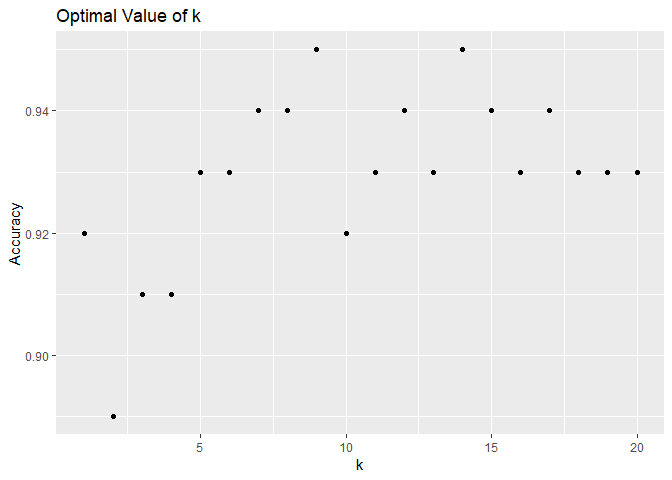

Breast Cancer Diagnosis Project
================
Anne (Annie) Lott
January 26, 2019

``` r
#set working directory externally
#read in data
cancer = read.csv("data.csv", header = TRUE, row.names = "id")

#load libraries
library(caret)
library(dplyr)
library(leaps)
library(caret)
library(e1071)
library(tibble)
library(ggplot2)
library(Deducer)
library(class)
library(rknn)
library(ROCR)

#set seed for data splitting
set.seed(1234)

#no missing values in this diagnostic data set
length(which(is.na(cancer)))
```

    ## [1] 0

``` r
#find out how many observations and variables there are
ncol(cancer)
```

    ## [1] 31

``` r
nrow(cancer)
```

    ## [1] 569

``` r
#determine how many malignant and benign cases there are
nrow(cancer[cancer["diagnosis"] == "B",])
```

    ## [1] 357

``` r
nrow(cancer[cancer["diagnosis"] == "M",])
```

    ## [1] 212

``` r
#split data 

#training data set will include 300 observations
train.idx = sample(nrow(cancer), 300)
cancer.train = cancer[train.idx,]

#everything that isn't in training set is in cancer.rest,
#which will be further divided up into a validation and test set
cancer.rest = cancer[-train.idx,]
test.idx = sample(nrow(cancer.rest), 100)
cancer.valid = cancer.rest[test.idx,]
cancer.test = cancer.rest[-test.idx, ]

#check that the division worked
nrow(cancer)
```

    ## [1] 569

``` r
nrow(cancer.train) + nrow(cancer.valid) + nrow(cancer.test)
```

    ## [1] 569

``` r
#check that there is an even distribution of benign and malignant 
#cases in the training, validation, and test sets
summary(cancer.train$diagnosis)
```

    ##   B   M 
    ## 189 111

``` r
summary(cancer.valid$diagnosis)
```

    ##  B  M 
    ## 65 35

``` r
summary(cancer.test$diagnosis)
```

    ##   B   M 
    ## 103  66

``` r
###########################
###########################
###                     ###
### Logistic Regression ###
###                     ###
###########################
###########################

#put variables in order of importance
#while testing out logistic regression
glm.mod = train(diagnosis ~ ., data = cancer.train, 
                method = "glm", family = "binomial")
import.vars = varImp(glm.mod)$importance %>% 
                  as.data.frame() %>%
                  mutate(rowname = rownames(.))%>%
                  arrange(desc(Overall))
vars = import.vars$rowname

#add each variable in the list of ranked variables
#iteratively to the model and compute the accuracy
#performs a variant of forward selection
varnum = 1:length(vars)
accuracy = rep(NA, length(vars))
for (ii in 1:length(vars)){
  #generate a formula including ii variables
  Formula <- formula(paste("diagnosis ~ ", 
                           paste(vars[1:ii], collapse=" + ")))
  
  #create the model
  partial.mod = glm(Formula, data = cancer.train, family = binomial)
  
  #predict the probability of malignancy
  cancer.probs.part = predict(partial.mod, cancer.valid, type = "response")
  
  #assign M to those observations with above 50% probability of 
  #malignancy, otherwise assign B
  cancer.pred.part = rep("B", nrow(cancer.valid))
  cancer.pred.part[cancer.probs.part >0.5] = "M"
  
  #store the accuracy of the model
  accuracy[ii] = mean(cancer.pred.part == cancer.valid$diagnosis)
}

#Plot the accuracy versus number of variables
plot(x = varnum, y = accuracy, ylab = "Accuracy", 
     xlab = "Number of Variables")
```


``` r
which.max(accuracy)
```

    ## [1] 10

``` r
#formula based on the most important 10 variables
Formula <- formula(paste("diagnosis ~ ", 
                         paste(vars[1:10], collapse=" + ")))

#create the model
glm.mod.final = glm(Formula, data = cancer.train, family = binomial)

#predict the probability of malignancy
glm.probs.final = predict(glm.mod.final, cancer.valid, type = "response")

#assign M to those observations with above 50% probability of 
#malignancy, otherwise assign B
glm.pred.final = rep("B", nrow(cancer.valid))
glm.pred.final[glm.probs.final >0.5] = "M"

#find the mean accuracy rate
mean(glm.pred.final == cancer.valid$diagnosis)
```

    ## [1] 0.96

``` r
#examine the confusion matrix
table(truth = cancer.valid$diagnosis, prediction = glm.pred.final)
```

    ##      prediction
    ## truth  B  M
    ##     B 61  4
    ##     M  0 35

``` r
#plot the ROC curve
rocplot(glm.mod.final) +
  ggtitle("Logistic Regression ROC Curve")
```


``` r
#look at the model summary
summary(glm.mod.final)
```

    ## 
    ## Call:
    ## glm(formula = Formula, family = binomial, data = cancer.train)
    ## 
    ## Deviance Residuals: 
    ##      Min        1Q    Median        3Q       Max  
    ## -1.93876  -0.06481  -0.01348   0.00047   2.23556  
    ## 
    ## Coefficients:
    ##                        Estimate Std. Error z value Pr(>|z|)    
    ## (Intercept)             -40.483     14.865  -2.723 0.006462 ** 
    ## compactness_mean       -201.158     71.018  -2.832 0.004619 ** 
    ## symmetry_worst           22.524      8.479   2.657 0.007895 ** 
    ## concave_points_mean       4.803     46.391   0.104 0.917542    
    ## radius_se                21.923      5.185   4.228 2.36e-05 ***
    ## perimeter_mean            4.054      1.650   2.457 0.014028 *  
    ## radius_mean             -25.381     10.524  -2.412 0.015879 *  
    ## concave_points_se      -523.338    202.433  -2.585 0.009731 ** 
    ## fractal_dimension_mean  410.398    198.523   2.067 0.038710 *  
    ## concavity_se             10.919     36.506   0.299 0.764864    
    ## concave_points_worst    110.291     29.293   3.765 0.000167 ***
    ## ---
    ## Signif. codes:  0 '***' 0.001 '**' 0.01 '*' 0.05 '.' 0.1 ' ' 1
    ## 
    ## (Dispersion parameter for binomial family taken to be 1)
    ## 
    ##     Null deviance: 395.373  on 299  degrees of freedom
    ## Residual deviance:  53.463  on 289  degrees of freedom
    ## AIC: 75.463
    ## 
    ## Number of Fisher Scoring iterations: 9

``` r
#############################
#############################
###                       ###
### SVMs w/Linear Kernels ###
###                       ###
#############################
#############################

#put variables in order of importance
#while testing out SVM with linear kernels
svm.mod = train(diagnosis ~ ., data = cancer.train,
                method = "svmLinear")

svm.var.import = varImp(svm.mod)$importance %>% 
                    as.data.frame() %>%
                    mutate(rowname = rownames(.)) %>%
                    arrange(desc(B), desc(M))

svm.vars = svm.var.import$rowname

#implement SVMs with linear kernels with different
#tuning parameter values
#use all the variables at first
tune.out1 = tune(svm, diagnosis ~ .,
                data = cancer.train, kernel = "linear",
                ranges = list(cost = c(0.001, 0.01, 0.1, 1, 5, 10, 100)))

#allow the cross-validation algorithm to select the best model
best.svm1 = tune.out1$best.model
#the best cost tuning parameter is 1

#add each variable in the list of ranked variables
#iteratively to the model and compute the accuracy
#performs a variant of forward selection
varnum.svm = 1:length(svm.vars)
accuracy.svm = rep(NA, length(svm.vars))
for (ii in 1:length(svm.vars)){
  #generate a formula including ii variables
  Formula.svm <- formula(paste("diagnosis ~ ", 
                           paste(svm.vars[1:ii], collapse=" + ")))
  
  #create the model
  partial.mod.svm = svm(Formula.svm, data = cancer.train, kernel = "linear",
                        cost = 1)
  
  #predict malignancy
  cancer.pred.svm = predict(partial.mod.svm, cancer.valid, 
                             decision.values = TRUE)
  
  #store the accuracy of the model
  accuracy.svm[ii] = mean(cancer.pred.svm == cancer.valid$diagnosis)
}

#Plot the accuracy versus number of variables
plot(x = varnum.svm, y = accuracy.svm, ylab = "Accuracy", 
     xlab = "Number of Variables")
```


``` r
which.max(accuracy.svm)
```

    ## [1] 6

``` r
#formula based on the most important 10 variables
Formula.svm.final <- formula(paste("diagnosis ~ ", 
                         paste(svm.vars[1:6], collapse=" + ")))

#create the model
svm.mod.final = svm(Formula.svm.final, data = cancer.train,
                    kernel = "linear",
                    cost = 1)

#predict malignancy
svm.pred.final = predict(svm.mod.final, cancer.valid,
                         decision.values = TRUE)

#find the accuracy of the SVM model
mean(svm.pred.final == cancer.valid$diagnosis)
```

    ## [1] 0.99

``` r
#examine the confusion matrix
table(truth = cancer.valid$diagnosis, prediction =
        svm.pred.final)
```

    ##      prediction
    ## truth  B  M
    ##     B 65  0
    ##     M  1 34

``` r
#write a function to extract performance measures from
#fitted decision values of the SVM and the actual 
#values of the diagnosis
roc.svm = function(pred, truth, ...){
  predob = prediction(pred, truth)
  perf = performance(predob, "tpr", "fpr")
  perf
  
}

#get the decison values from the SVM prediction
fitted = attributes(svm.pred.final)$decision.values

#find the false positive and true positive rates from the
#(hella weird) performance object
fpr = roc.svm(fitted, cancer.valid$diagnosis)@x.values
tpr = roc.svm(fitted, cancer.valid$diagnosis)@y.values

#put fpr and tpr, which are lists, into a data frame
roc.dat = data.frame(false_pos_rate = as.vector(fpr[[1]]), 
                     true_pos_rate = as.vector(tpr[[1]]))

#create a prediction object from the fitted values and the 
#actual values of the diagnosis
predobj = prediction(fitted, cancer.valid$diagnosis)

#find the area under curve for this prediction object
auc.obj = performance(predobj, measure = "auc")

#access and round the AUC value
auc.value = round(auc.obj@y.values[[1]],3)

#create a diagonal line data frame for reference
diag = data.frame(x = seq(0,1,by= 0.001), y = seq(0,1, by= 0.001))

#plot the ROC curve in ggplot2
p = ggplot(roc.dat, aes(x = false_pos_rate, y = true_pos_rate)) +
      geom_point(color = "green") + geom_line(color = "green") +
      geom_line(data = diag, aes(x = x,y = y), color = "red")
p + geom_point(data = diag, aes(x = x, y = y), color = "red") +
  theme(axis.text = element_text(size = 10),
        title = element_text(size = 12)) + 
  labs(x = "1 - Specificity", y = "Sensitivity", title = "ROC curve") +
  annotate("text", x = 0.85, y = 0.1, 
           label = paste("AUC: ", auc.value))
```


``` r
###########################
###########################
###                     ###
###    kNN Modeling     ###
###                     ###
###########################
###########################

#create training, validation, and testing matrices to fit the 
#knn function requirements
train.X = as.matrix(cancer.train[,2:ncol(cancer.train)])
valid.X = as.matrix(cancer.valid[,2:ncol(cancer.valid)])
test.X = as.matrix(cancer.test[,2:ncol(cancer.test)])
train.Y = cancer.train$diagnosis
valid.Y = cancer.valid$diagnosis
test.Y = cancer.test$diagnosis

#find the optimal subset of predictors when k = 10, a good 
#starting point
knn.obj = rknnBeg(train.X, train.Y, k = 10, r = 500, 
                  mtry = trunc(sqrt(ncol(train.X))),
                  fixed.partition = TRUE,
                  pk = 0.5, stopat = 4,
                  cluster = NULL, seed = NULL)
bestset(knn.obj)
```

    ## [1] "area_worst"           "perimeter_worst"      "radius_worst"        
    ## [4] "perimeter_mean"       "area_se"              "concavity_mean"      
    ## [7] "concave_points_worst" "radius_mean"

``` r
#use the subset of predictors selected in the training, validation
#and test variable matrices
train.X.subset = as.matrix(cancer.train[,bestset(knn.obj)])
valid.X.subset = as.matrix(cancer.valid[,bestset(knn.obj)])
test.X.subset = as.matrix(cancer.test[,bestset(knn.obj)])

#find the optimal k based on the validation set accuracy
k.optimal.subset = 1:20
k.accuracy.subset = rep(NA, 20)
for (ii in 1:20){
  knn.pred.subset = knn(train.X.subset, valid.X.subset, train.Y, k=ii)
  k.accuracy.subset[ii] = mean(knn.pred.subset == valid.Y)
}
plot(k.optimal.subset, k.accuracy.subset, xlab = "k", ylab = "Accuracy")
```



``` r
which.max(k.accuracy.subset)
```

    ## [1] 9

``` r
#use the optimal k from the loop in the final knn model
knn.final.pred1 = knn(train.X.subset, valid.X.subset, train.Y, 
                     k = which.max(k.accuracy.subset))

#look at the accuracy
mean(knn.final.pred1 == valid.Y)
```

    ## [1] 0.95

``` r
#examine the confusion matrix
table(truth = valid.Y, prediction = knn.final.pred1)
```

    ##      prediction
    ## truth  B  M
    ##     B 64  1
    ##     M  4 31
